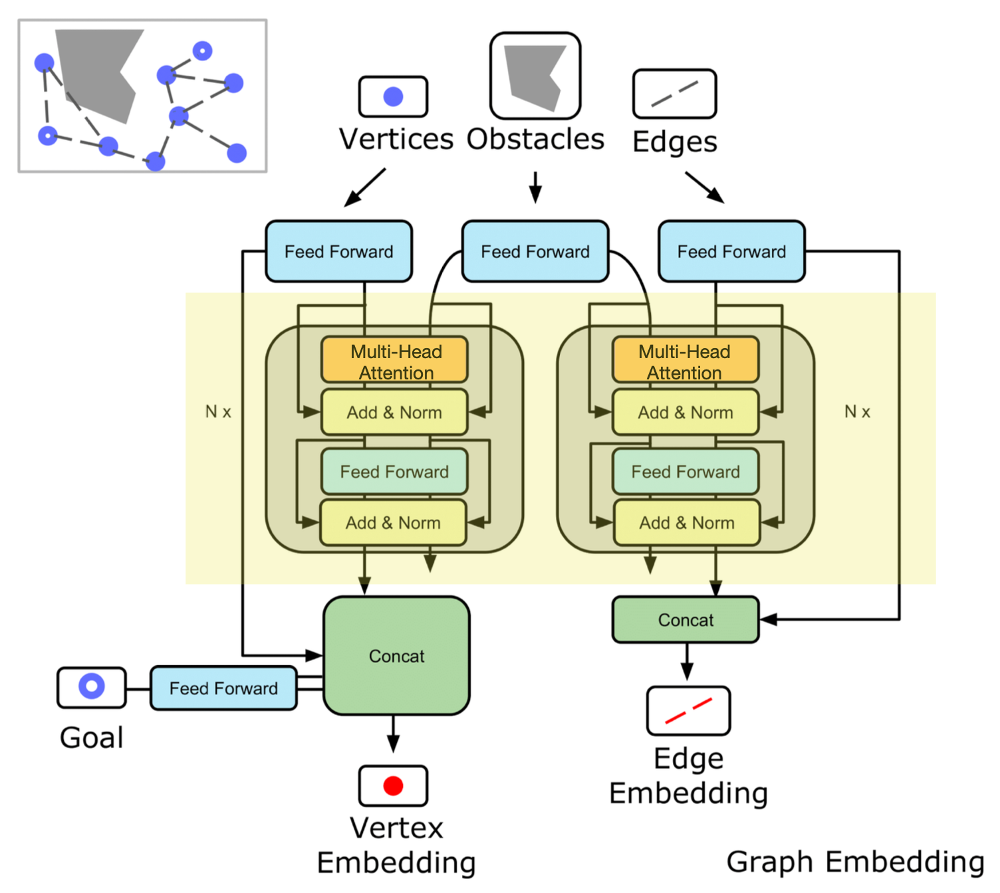
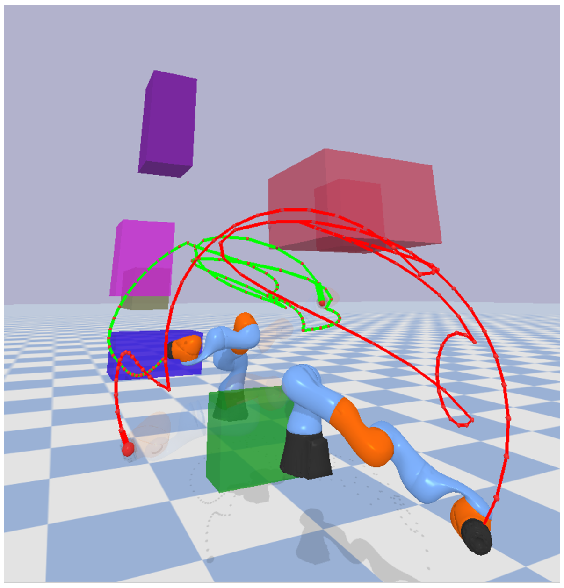
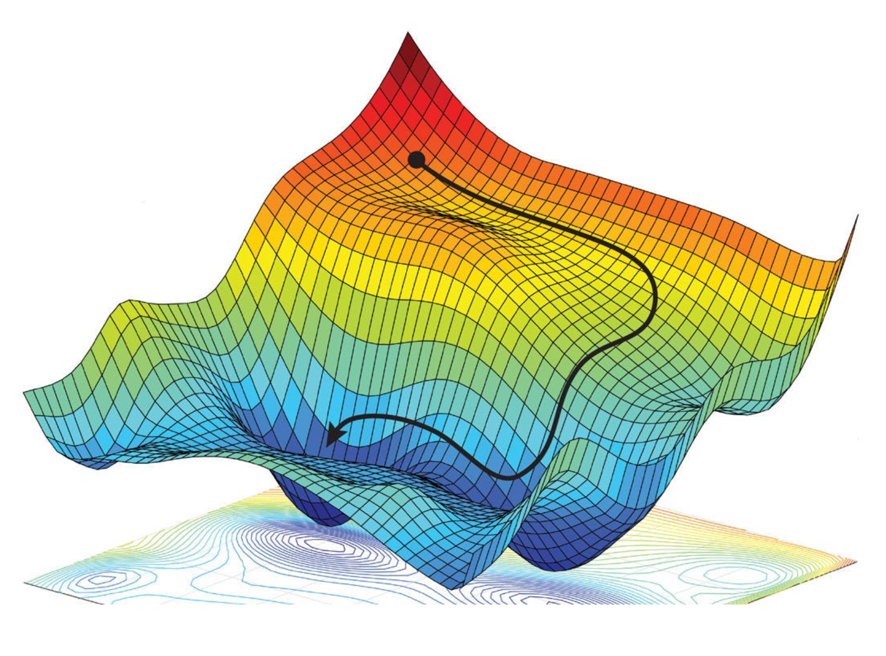
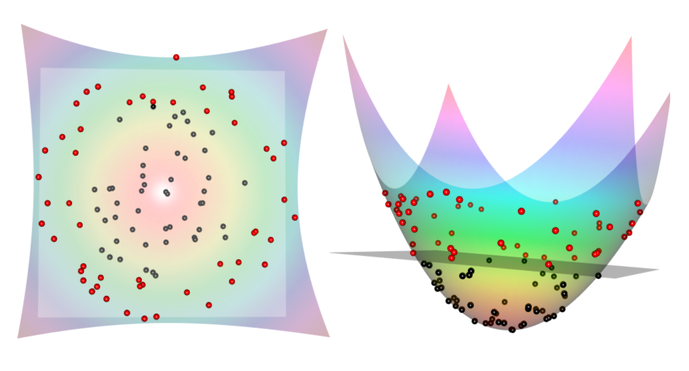
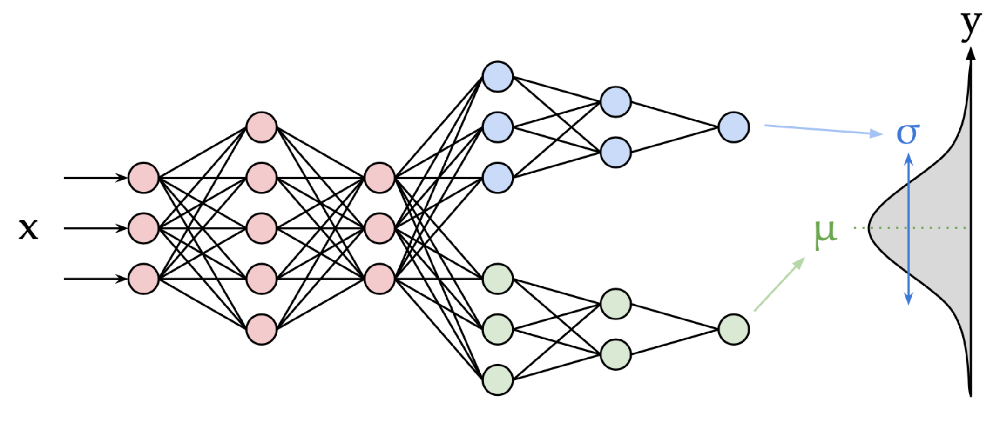
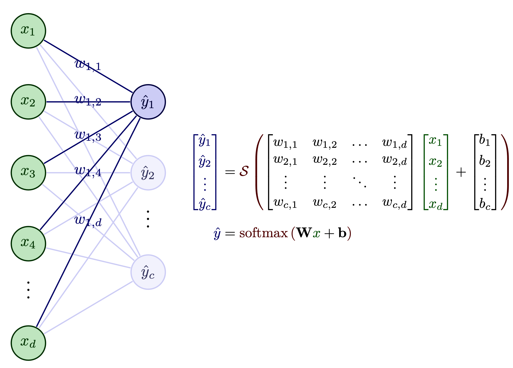
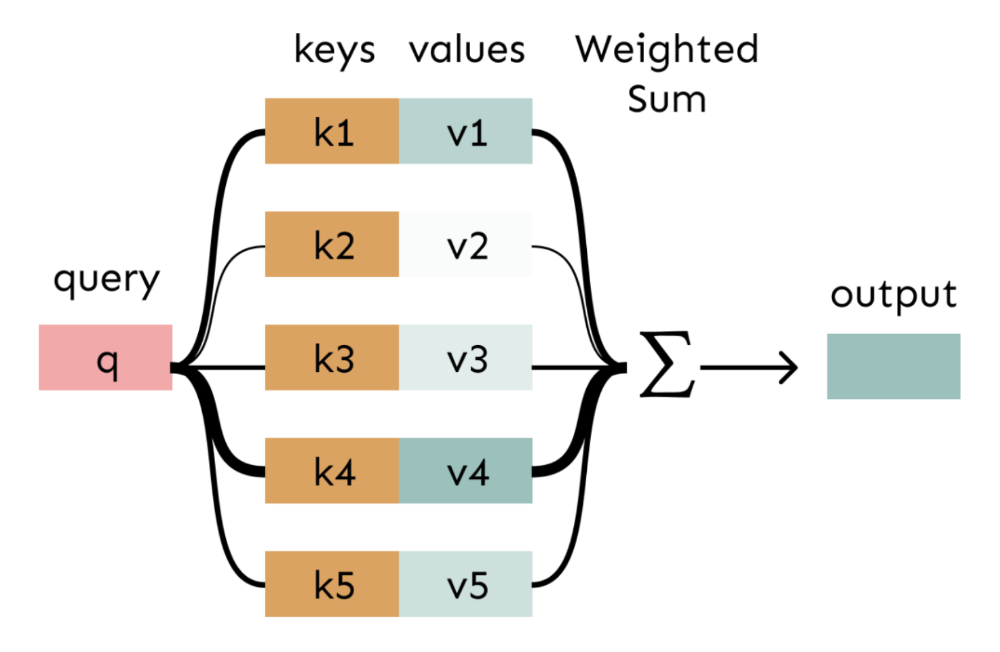
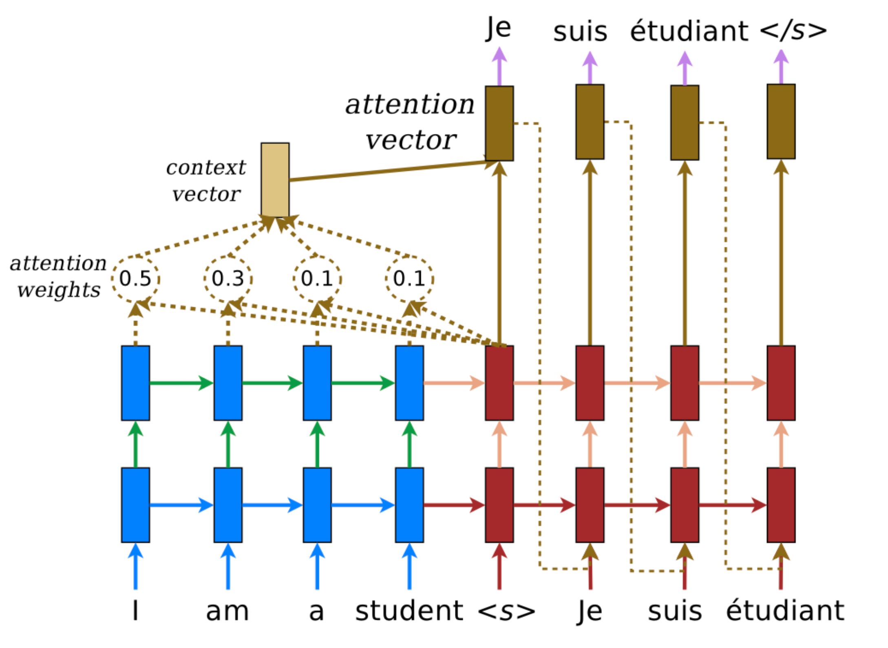
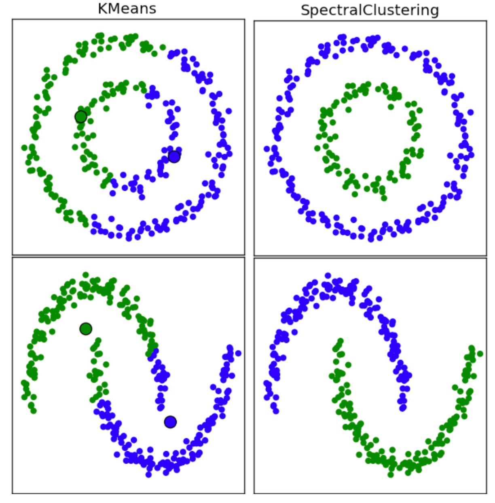

# Mathematical Foundations for Machine Learning

Summary of Math Foundations of Machine learning course that offered a comprehensive exploration of the mathematical principles critical for mastering and deploying machine learning algorithms. It covered the foundational mathematics underlying key machine learning techniques, including regression, classification, clustering, and dimensionality reduction, as well as advanced topics such as contrastive learning. The course was presented to bridge the gap between theoretical mathematics and practical machine learning, equipping with both the deep mathematical understanding and the hands-on experience necessary to implement and apply machine learning models in diverse real-world scenarios.

Professor George Turkiyyah

## Key Modules

The course is structured around fundamental questions in machine learning:

1. **What are the mathematical tools underlying machine learning algorithms?**
2. **How can these tools be applied to solve real-world data science problems?**
3. **What are the limitations and potential of these mathematical methods?**

## Learning Outcomes

- **Master core mathematical concepts** used in data science and machine learning.
- **Develop the ability to translate** machine learning problems into a mathematical framework.
- **Gain practical experience** in applying mathematical methods to real data.

## Course Assignments:

1. Clustering Iris Dataset and K-Means sum of squares minimization mathematical proof. [Folder](assignments/1_Clustering)
2. Multi-class classification using Least Squares Iris and MNIST Dataset, feature engineering. [Folder](assignments/2_LeastSquares)
3. Spectral Clustering, low dimensional representations of large scale data set using (SVD). [Folder](assignments/3_SVD_SpectralClustering)
4. Gradient of cross-entropy loss for Binary logistic regression, automatic diferentation and computational graph. [Folder](assignments/4_AutomaticDifferentiation_gradient)
5. Multi-class logistic regression using stochastic gradient descent, hypergradient optimization. [Folder](assignments/5_LogisticRegression_SGD)
6. Neural Networks for MNIST classification, gradient descent step length derivation. [Folder](assignments/6_NeuralNetwork_Classifier)
7. House price prediction with MLP, word analogies (Word2Vec) implementation, sentiment analysis using word embeddings. [Folder](assignments/7_Word2Vec_SentimentAnalyzis)
8. Text topic classifier of newspaper, Digits classifier using CNN. [Folder](assignments/8_TextClassifier_CNN)
9. Autoencoder for MNIST Dataset, variational autoencoder, sentiment classifier using Recurrent Neural Networks (RNN). [Folder](assignments/9_Autoencoder_RNN)
10. Language classifier using RNN, names generation using RNN for a determined language. Word2Vec Theory. [Folder](assignments/10_RNN_Word2Vec)

## Course Project - Motion Planning Using Graph Neural Networks:

Implementation of a multi-head attention feature extractor with a graph neural network model to perform the path exploration. The path exploration takes the graph generated by the sampled points in the space to then decide the edge to explore in the environment until the destination goal is present in the explored edges and nodes. The designed model was trained using a reference algorithm Dijkstra for path planning and tested in two environments with 2 and 14 degrees of freedom. 

Project developed using study: 

C. Yu and S. Gao, "Reducing collision checking for sampling-based motion planning
using graph neural networks," in Advances in Neural Information Processing
Systems, vol. 34, pp. 4274–4289, 2021.

  
  

## Course Content:

### 1. Linear Algebra Foundations
- Vectors, matrices, and matrix operations.
- Matrix decompositions, including LU, QR, EVD, and SVD.
- Matrix calculus.

### 2. Optimization Foundations
- Introduction to optimization techniques, including gradient descent and stochastic gradient descent (SGD).
- Proximal gradient methods and automatic differentiation.
- Optimality conditions.

### 3. Statistical Foundations
- Random variables, Gaussian distributions, and empirical risk minimization.
- Mixture models, maximal likelihood estimation.
- Decision theory and Gaussian discriminant analysis.

### 4. Regression and Classification
- Logistic regression, least squares, ridge, and Lasso regression.

### 5. Neural Networks
- Multilayer perceptrons, activation functions, and deep networks.
- Backpropagation and training techniques.
- Convolutional networks and recurrent networks.
- Transformer architectures.

  
  
  

### 6. Dimensionality Reduction and Clustering
- Principal component analysis (PCA), matrix sketching, and randomized algorithms for SVD.
- Rank-k approximation, Eckart-Young bounds, and matrix completion problems.
- K-means clustering, Voronoi diagrams, and nearest neighbor classification.

### 8. Graph Representations and Spectral Clustering
- Graph Laplacian and Fiedler vectors.
- Spectral clustering with multiple eigenvectors.

